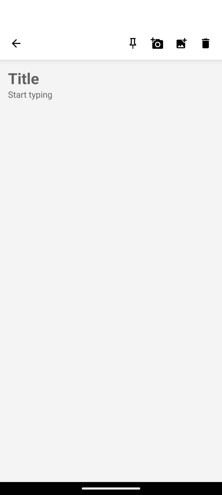

# Notes App

Mobile App that allows you to create simple notes build with Expo.

<div>




</div>

## Features

- Create, Update and Delete notes
- Pin notes
- Add images to notes

## Getting Started

### Prerequisites

- Install the [Expo Go](https://play.google.com/store/apps/details?id=host.exp.exponent&pli=1) app on your device or emulator

- Install the EAS CLI and log in with your [Expo Account](expo.dev)

  ```bash
  npm install -g eas-cli
  eas login
  ```

### Installation

1. Get the code into your local machine and install all dependencies

   ```bash
   git clone https://github.com/NanddoSalas/notes.git
   cd notes
   yarn install
   ```

2. Start the development server

   ```bash
   yarn start
   ```

3. Open the Expo App and scan the QR Code printed by the development server

### Build Process

Get an APK artifact by runing

```bash
eas build -p android --profile preview1

```

## License

[MIT](LICENSE)
